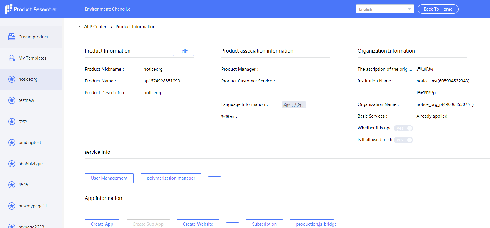

# Social管理台交接文档

> 提供Social管理台交接文档记录，方便交接人查看

## Social管理台包含范围

* Social管理台（admin）

## 答疑联系人

* 郑美双 917520 （web前端）
* 何承栋 423233 （admin服务端）
* 倪丹 317036（新闻、论坛模块）
* 李茵茵 655863（通知公告、我的页面、应用列表模块）
* 刘煌武 351252（微博、佛历模块）
* 林贻概 930203（商城模块）
* 程兰云 367289（抽奖、背包、预订模块）
* 江联伟 857908（二组组件部分）
* 孙仙钟 830624（三组组件部分）
* 应用快速集成受理号 10005015 （聚合后台）
* 邬可菲 901010（rbac）
* 王圳尧 950817（uc）

## 组件项目说明

* [Wiki](http://wiki.doc.101.com/index.php?title=Social_%E7%AE%A1%E7%90%86%E5%90%8E%E5%8F%B0)

### 项目启动说明

* 开发前

  * 下载工程项目代码，下载完后需要额外添加两个文件到项目中，这两个文件不上传git（已写在了gitignore中）。[.shouldnotpublic](http://gcdncs.101.com/v0.1/download?dentryId=54d3bd0b-797b-442a-a3d4-df552c4e5caf&serviceName=social_admin&attachment=true) &nbsp;&nbsp;&nbsp; [module.js](http://gcdncs.101.com/v0.1/download?dentryId=4a1106d9-ef00-4c93-9897-375ab046318e&serviceName=social_admin&attachment=true)  

  * 新建特性，特性分支的拉取不基于master分支拉（由于master上会有预生产的特性，未发布到生产环境，所以不能算稳定分支），而是要基于最新标签拉取
   

  &nbsp;&nbsp;最新标签可根据版本履历查看： 

  * 加载模块：运行项目前先 执行 `npm run loadMod` ，然后选择 加载模块，回车一下，然后选择具体的模块名，空格键选中。这样项目运行时只会去加载你选择的模块了
为什么要执行这个命令呢？ 如果不执行这个命令，那么项目启动的过程中会把所有模块全加载进去，运行一次  30min+ ，自己惦量吧，嘿嘿

  * 启动项目：执行 `npm start` 或 `SDP_ENV=test npm start`（git bash中有效）

  * 安装代理：由于admin项目的请求都是走的代理，有些接口可能在本地运行中没法请求，建议安装浏览器代理，装个 fiddler 和浏览器代理插件。将线上的地址映射到本地来做开发。
具体代理插件的安装配置就不说了，网上搜一下很多教程的

* 开发中

  * admin项目的ui控件依赖的是 ndfront 库，如果开发过程中有发现库中的某个控件有bug或无法满足需求，可以联系 郑美双（917520）添加到 ndfront 项目中，做修复或完善。
注意：admin项目并无具体的开发文档，开发过程中需要阅读阅读 ndfront 源码哦

* 提测发布

  * 首先填写[版本履历](https://doc.weiyun.com/508c5a278f9e1605637ddaa41afcf44b)，将要提测的特性填写上去

  * 发布到测试环境：测试环境由各位开发者将自己的特性分支合并到最新的 Release 分支上，然后以 Release 分支发布测试环境
怎么判断哪条 Release分支最新呢？ 根据Release后面的版本号，最大的肯定是最新的，比如 目前的最新是 Release/v22.8

  * 发布到预生产和生产环境：由于admin项目比较大，所以这两个环境使用的是线下打包，故 预生产和生产环境 的发布是我这边打包，开发同学只需在版本履历上对要发布的特性标注测试通过，再99u通知 `蓝萍（325946）` 一下就好了。

### 项目调试说明

* 正常使用 chrome devtools 工具开发调试

* 使用代理调试线上地址：

  * 安装 Fillder 代理，并设置好 AutoResponder 的地址映射，如：

    * `regex:http://admin.debug.web.nd/$`  &nbsp;&nbsp;&nbsp;   `http://192.168.253.80:3000/`

    * `regex:http://admin.debug.web.nd/((?!v0\.).*)` &nbsp;&nbsp;&nbsp;  `http://192.168.253.80:3000/$1`

  * 修改本地项目启动的环境，`SDP_ENV=test npm start` 文件里将 `test` 改为对应环境名

  * 项目中添加 `debugger` 进行调试

### 项目开发注意事项

* 样式，当重写某个类名样式时，需要注意限制好选择器范围，不然容易 `样式污染` 到其他模块的界面

* 菜单：当有新增加菜单时，需要注意添加的它的权限code，以及后续发布时需要对接到聚合后台，对接步骤可见下面 `开发经验总结及其他注意事项`

* rbac: 确定权限控制的范围，菜单权限是最外层，按钮交互权限是里层，可根据策划原型案来决定

* 多语言：项目中的多语言允许使用中文作为key值，`var __ = require('nd-i18n')` &nbsp;&nbsp; `__('多语言')`

### 项目发布注意事项

* 注意更新rbac，步骤可见下面 `开发经验总结及其他注意事项`

* 多语言更新，步骤可见下面 `开发经验总结及其他注意事项`

## 开发经验总结及其他注意事项

### 接入聚合后台

#### 菜单配置

##### 新服务接入

如果是一个全新的服务接入聚合后台，那么操作步骤会由于环境的不同而不同，新服务接入 需要 服务端同学 去服务管理那边注册这个服务

* 测试环境，有时候QA会要求我们把菜单配置测试环境测试，这我们能拒绝吗？并不能，谁让开发在食物链的最低端呢，那只能老老实实的配了。根据 [聚合后台-演示信息](http://wiki.doc.101.com/index.php?title=%E8%81%9A%E5%90%88%E5%90%8E%E5%8F%B0-%E6%BC%94%E7%A4%BA%E4%BF%A1%E6%81%AF#.E9.99.95.E8.A5.BF.E7.BD.91.E6.95.99.E9.80.9A.E7.8E.AF.E5.A2.83)所提供的账号。

 进入聚合后台管理后台    

* 预生产环境，前提：服务端同学已经在服务管理处开通了该服务，并把你加入进去了。预生产和生产的配置通过技术货架进入，下面以商城为例：

   

菜单接入聚合后台有两种方式（仅以我所知的），一是 全局菜单；而是 单产品下的私有菜单

##### 全局菜单

这个好理解，就比如微博组件下新增了一个菜单项，该菜单项的功能是通用，就可以配置为全局菜单，即对所有开通了微博服务的产品均可见

测试环境配置： 同 1.1 的菜单添加步骤
预生产&生产的配置步骤： 同1.2 的配置步骤

##### 产品私有菜单

单独为某个产品开发的功能菜单项，不希望其他产品能看到

配置步骤：以某个产品的聚合后台为例

 

#### RBAC权限设置

##### 预生产环境权限设置

RBAC 运维后台：`http://rbac-admin.beta.101.com/#/cmps/_g/`
账号： admin@ndtest /  123456

###### 手动添加

    

###### 导入

比如说你在其他环境有配置好了权限，这时候为了减少人工操作失误的成本及提高效率，可在配置好的环境中点击导出，再在需要配置的环境中点击导入即可。

通常预生产环境是需要手动添加（除非是通过脚本上传），因为业务方测试&预生产环境接入的都是RBAC的预生产环境

##### 生产环境权限设置

生产环境的 RBAC 配置是强烈建议使用导入，将预生产配置好的导出，再导入到生产，预生产配置的都是经过QA同学测试的，极大概率能保证不会出错。（能受得了线上bug就当我没说ヽ(ˋ▽ˊ)ノ）。操作入口：

#### 聚合后台菜单与RBAC权限绑定

配置完菜单和 RBAC 后，为了让RBAC权限控制生效，就需要将菜单项和对应的RBAC权限绑定起来了。

绑定的操作各个环境都一样

#### 国际化设置

语言资源提取请参照项目中 js/docs/多语言.md 文档说明，获取到语言后，翻译完上传到线上。线上地址：

 

#### 聚合后台菜单国际化

最近有发现一个问题，即聚合后台菜单的国际化问题，发现很多组件在接入聚合后台的时候忽略了菜单名的国际化配置。

问题复现：

  

## 常见FAQ

* Q：开通新服务时在服务名称列表里找不到自己的服务怎么办？

* A：这种情况一般是服务端同学未在服务管理中注册服务，需要让服务端同学操作下，如果还不行的话，可以联系 `应用快速集成受理号` 寻求帮助。

* Q：在技术货架中没看见 组件配置按钮 怎么处理？

* A：没看见这个按钮是因为当前账号的权限不够，需要找对应的负责人添加。

  

* Q：怎么知道配置菜单地址的时候聚合后台的参数支持情况？

* A：可查阅 [聚合后台页面接入规范](http://wiki.doc.101.com/index.php?title=%E8%81%9A%E5%90%88%E5%90%8E%E5%8F%B0-%E6%8E%A5%E5%85%A5%E8%A7%84%E8%8C%83-%E4%BD%BF%E7%94%A8%E8%81%9A%E5%90%88%E5%90%8E%E5%8F%B0)，这里列举admin管理台的菜单址配置供参考：
`https://admin.beta.101.com/#/shop/goods?mode=embed&sdp-app-id={__app_id}&sdp-user-id={sdp_user_id}&auth={__mac}`
具体地址的配置因不同管理台而异。
