# 通知公告组件交接文档

> 提供通知公告组件交接文档记录，方便交接人查看

## 通知公告组件包含范围

* [公告web端](http://d.101.com/modules/web/detail.html#/home/5a7d625345ce13f3ffcb7791)
* [公告H5端Js组件](http://d.101.com/modules/mobileComponent/detail.html?appId=57de2b1845ce30bd22f78096#/)
* [公告H5端业务插件](http://d.101.com/modules/businessComponent/detail.html?appId=57837c9345ce86f8dd552701)

## 答疑联系人

* 郑美双 917520 （web、H5）
* 何承栋 423233 （服务端）
* 李茵茵 655863 （QA）
* 颜志炜 734819 （应用工厂IOS）
* 苏昌骏 606198 （应用工厂Android）

## 组件项目说明

* [技术货架颗粒信息](https://ts.101.com/#/shelvesDetail?id=ff80808164c511110164d0d0eeff0064)

### 项目启动说明

#### 公告web端

* `npm install` -> `npm start`

* 浏览器使用 `localhost:9996` 或者 `http://127.0.0.1:9996` 来访问，不能使用本地ip访问，否则初始化One的环境会是 `product` 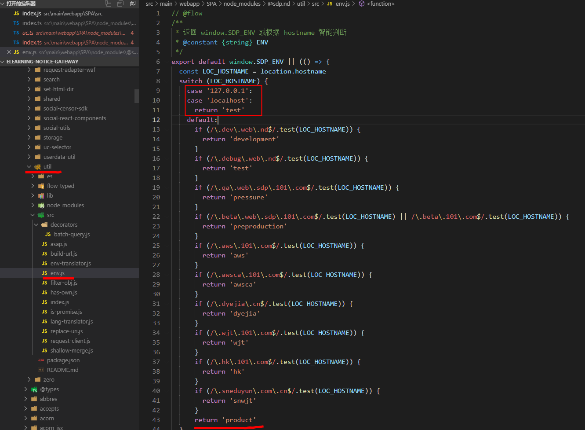

* 默认启动的环境是测试环境的，日常开发维护排查问题中常需要本地启动预生产或生产的环境，这时候就需要做些修改，然后再执行`npm start`，看下图：
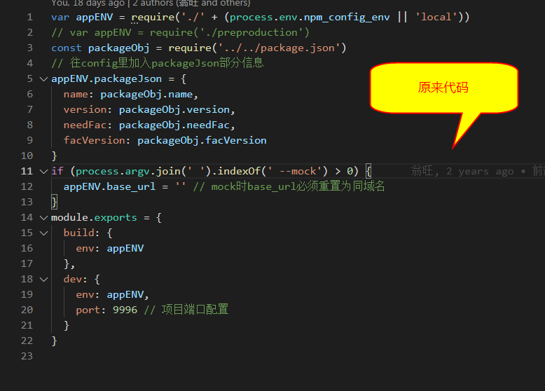  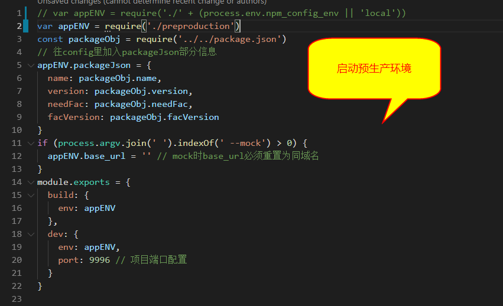

* 快速登录的话使用 [uctoken工具](http://gcdncs.101.com/v0.1/download?dentryId=8fb06af5-7aa5-479a-aa68-5c3547595837&serviceName=static&attachment=true)，配置如下图（以公告测试环境为例）：
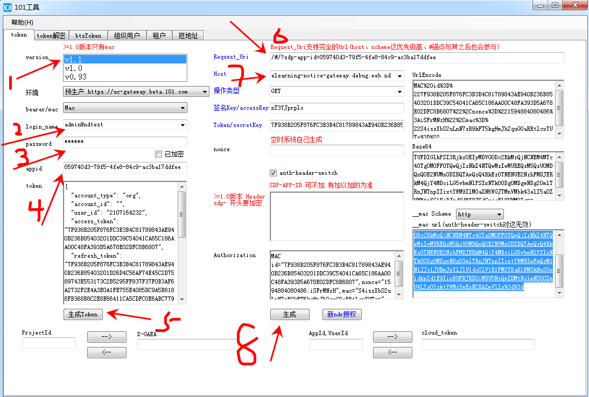

#### 公告H5端

* `npm install` -> `npm run dev`

* 在执行 `npm run dev` 之前需要将这两个地方修改本地ip
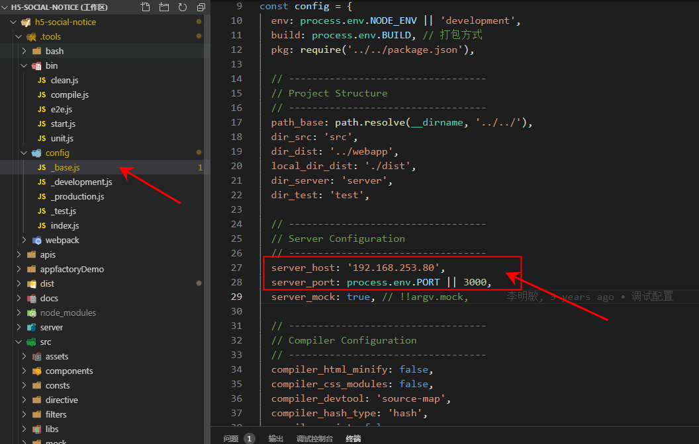  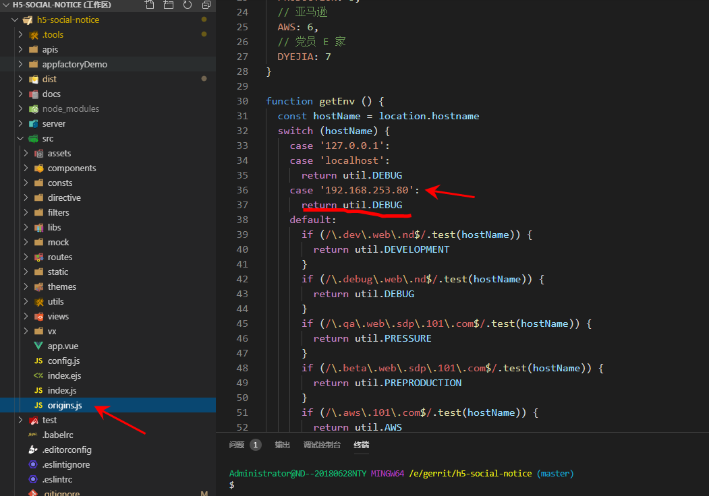

### 项目调试说明

#### 通知公告Web端

* 正常使用 chrome devtools 工具开发调试

#### 通知公告H5端

* 开发时需要本地安装模拟器进行开发调试：

  * 安装应用apk，通过地址 `http://127.0.0.1:3000`（本地服务起在3000）访问

  * 勾选`fiddler`的 `allow remote computers to connect`

  * 设置模拟器代理，打开桌面的设置 --> WALN --> 长按，出现修改网络 --> 高级选项，设置代理地址为本地主机ip

  * 这样访问`127.0.0.1:3000`就能看到本地启的项目了

  * Chrome Inspect 调试，`chrome://inspect/#devices` 需要翻墙访问谷歌的 `https://chrome-devtools-frontend.appspot.com/` 地址，所以本地要装个翻墙工具（也有遇到不装也能用的，所以装之前先试下能不能用）

  * 找个工厂打包的应用，访问 `http://ip:3000/` 就好了

  * 总结：就是将本地的端口代理到 fiddler 的8888端口，在将模拟器的访问也代理到 fiddler 的8888端口，是实现在模拟器上访问 `127.0.0.1:3000` 能访问到本地启的服务

### 项目开发注意事项

#### 通知公告Web端开发注意事项

* [url上支持的参数配置](http://wiki.doc.101.com/index.php?title=%E5%85%AC%E5%91%8A%E7%BB%84%E4%BB%B6-WEB%E7%AB%AF)

* 公告的发布权限（这部分可以详情问美双，有案子设计的文档）

* 多语言部分 可以看项目里的 `readme.md` 说明

#### 通知公告H5端开发注意事项

* H5 端是用的jsBridge，只能在工厂打包的应用中打开才有

* H5 端的框架是 vue1.x 的，所使用的UI库是 `初代目 —— 李敏明` 自己做的 `kakashi-ui` 和 `kakashi-theme` 库，这两个库目前在美双手上维护

### 项目发布注意事项

#### 通知公告Web端发布注意事项

* 无，共享平台正常发布即可

* 若翻译平台上有语言更新，则需要重新补发一次项目，项目中的脚本会自动拉取最新的语言包

#### 通知公告H5端发布注意事项

* js组件发布更新：正常共享平台发布即可
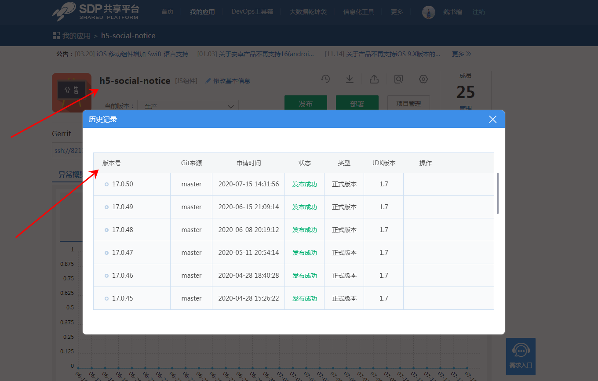

* 移动业务插件发布：

  * 多语言有更新的话需要先上传语言资源，执行项目的 `npm run build` 在 dist 文件里知道 i18n 文件。上传完后切翻译分支进行翻译
  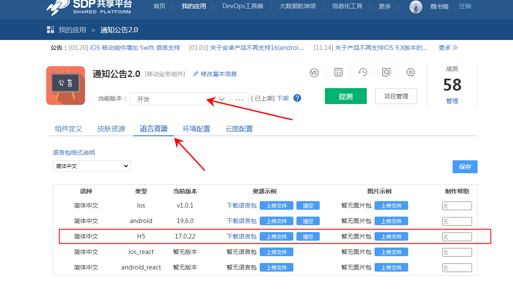 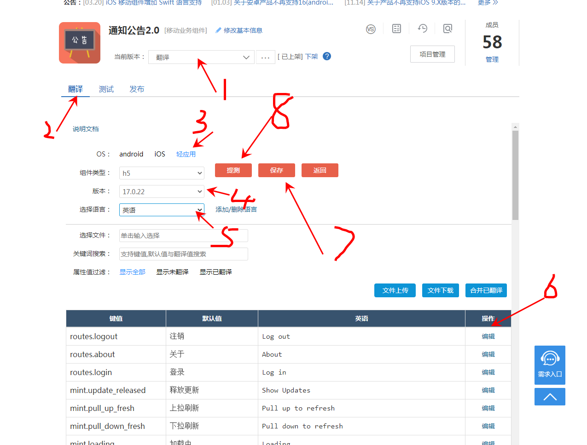

  * 样式有更新的话需要先上传皮肤资源，执行项目的 `npm run build` 在 dist 文件里知道 style 文件上传
  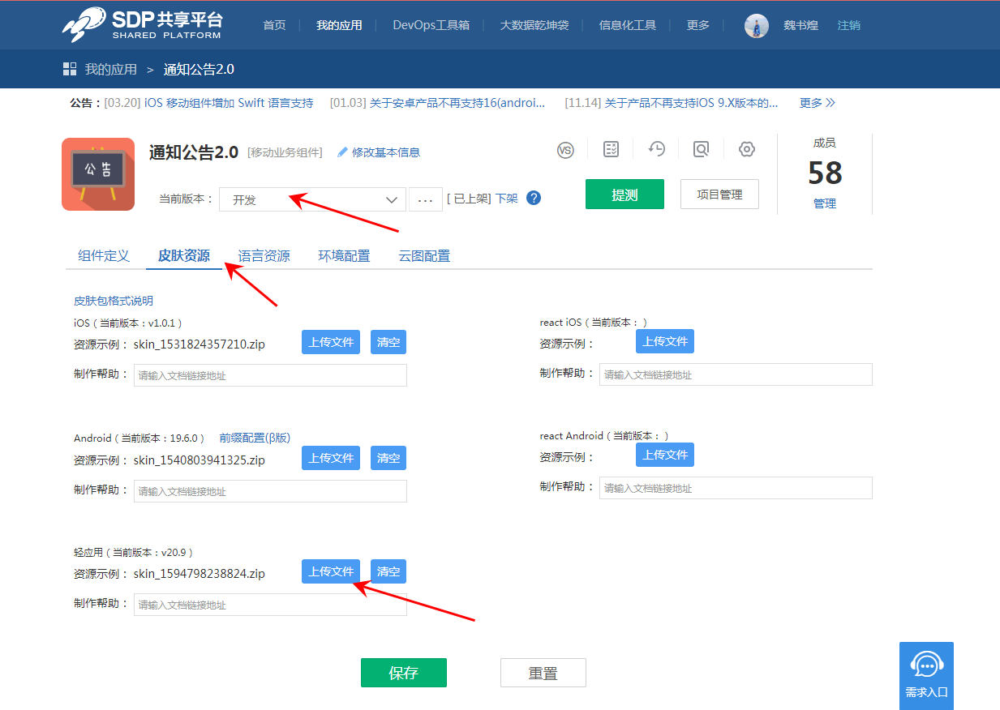

  * 先修改XML里的 `h5-social-notice` 的版本号为对应的js组件的版本号，然后保存，提测
  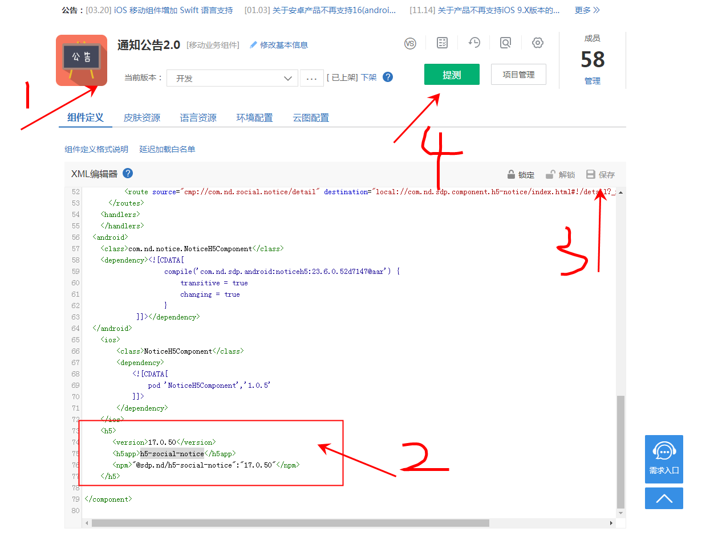

## 开发经验总结及其他注意事项

* [公告web对接UC1.1](https://docs.qq.com/doc/DZkFrSFV2b0VLenZU)

* 通知公告组件对于发布公告权限和发布对象，有较多的权限判断条件，具体可以找美双了解

* 公告H5如遇到机型适配问题，可以让QA提供机型

## 常见FAQ

* 无
