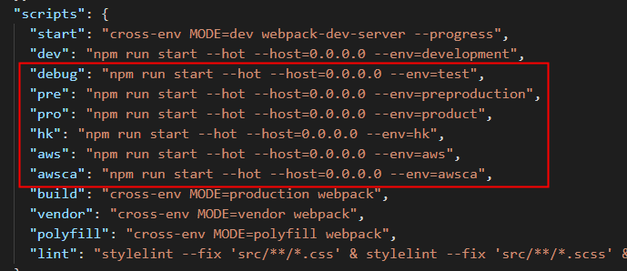
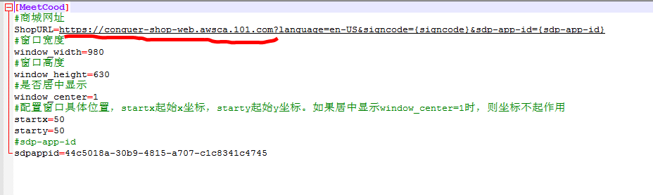

# 商城组件交接文档

> 提供商城组件交接文档记录，方便交接人查看

## 商城组件包含范围

* [商城web端](http://d.101.com/modules/web/detail.html#/home/5a52e48845cee8403b294103)
* [征服商城](http://d.101.com/modules/web/detail.html#/home/5dba4c3c48191d0010329343)
* [多商户运营后台](http://d.101.com/modules/web/detail.html#/home/5c0e226045ce9268e91c2d2b)
* [多商户运维后台](http://d.101.com/modules/web/detail.html#/home/5c0e243245ce9268e91c4442)

## 答疑联系人

* 郑美双 917520 （web）
* 周颖 901425 （服务端）
* 林贻概 930203 （QA）
* 林维城 608920 （征服商城内置浏览器）
* 范剑秋 155015 （AE框架）
* 魏国才 230703 （钱包SDK）

## 组件项目说明

* [技术货架颗粒信息](https://ts.101.com/#/shelvesDetail?id=ff80808164c511110164d0d0c4740033)

### 项目启动说明

#### 商城web端 & 征服商城

* `npm install` -> `npm run debug`

* 启动其他环境执行对应的脚本即可

#### 多商户运营后台 & 多商户运维后台

* `npm install` -> `npm run dev`

* 这个后台是使用AE2.x的框架做的，正常启动就行

### 项目调试说明

#### 商城web端 & 多商户运营后台 & 多商户运维后台

* 正常使用 chrome devtools 工具开发调试

#### 征服商城

* 本地先启动服务

* 征服商城的登录走跟UC不一样的链路，需要外部在url上传`signcode`参数，测试环境调试可使用 [征服商城测试环境账号](https://doc.weiyun.com/b4708c5bae34dedead10152a601bf3dc)，将测试环境的域名改为本地服务的 IP:端口号 即可

* 征服商城的分辨率是 `908 * 630`，浏览器上修改网页分辨率为 `908 * 630` 进行项目调试

* 由于林维城所提供的内置浏览器是49.0 版本的，低版本浏览器上会存在一些css 或 js 代码的兼容性，当碰到这个问题的时候可以使用 [49.0版本的谷歌浏览器](http://gcdncs.101.com/v0.1/download?dentryId=b7c01b99-c916-40cd-881c-c565a99f0e80&serviceName=shop2&attachment=true)；打开 `.exe`文件，右键 `Show DevTools` 调出控制台，然后输入 `window.location.href=xxx` 输入征服商城地址即可

* awsca环境上的调试只能通过游戏客户端进入，打开商城，然后修改 `【英文征服】\ShopClient\MeetCood.ini` 文件里的URL 为本地地址（本地启awsca环境的服务）。游戏客户端可以找 林贻概 或者 刘凡 提供

### 项目开发注意事项

* 无

### 项目发布注意事项

#### 商城web端 & 多商户运营后台 & 多商户运维后台 发布注意事项

* 无，共享平台正常发布即可

#### 征服商城 发布注意事项

* 只需要发布测试环境及awsca环境即可

## 开发经验总结及其他注意事项

* 无

## 常见FAQ

* 无
